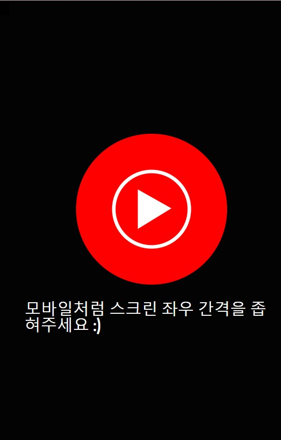
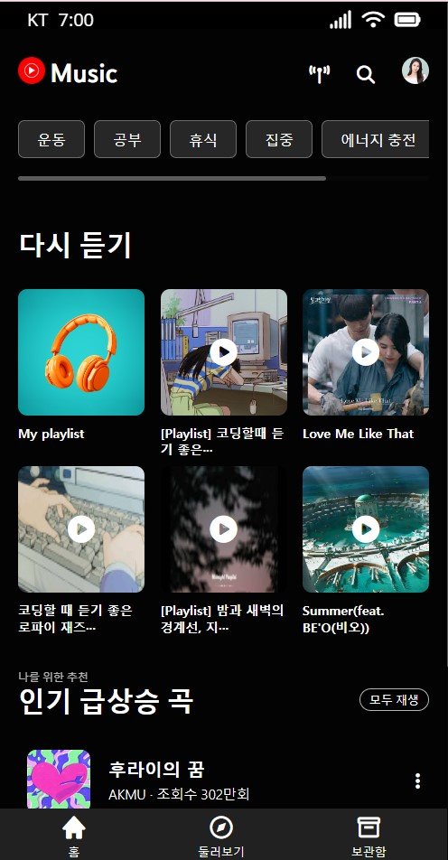
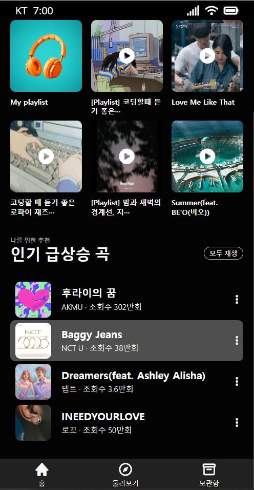
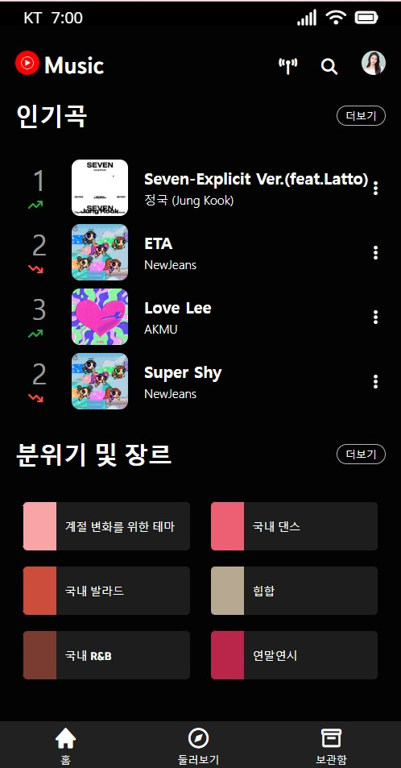
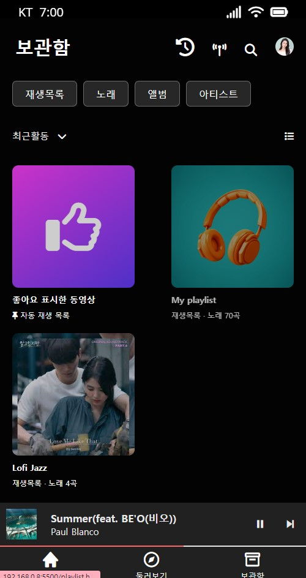
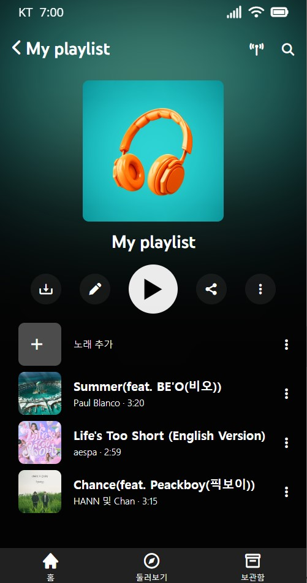
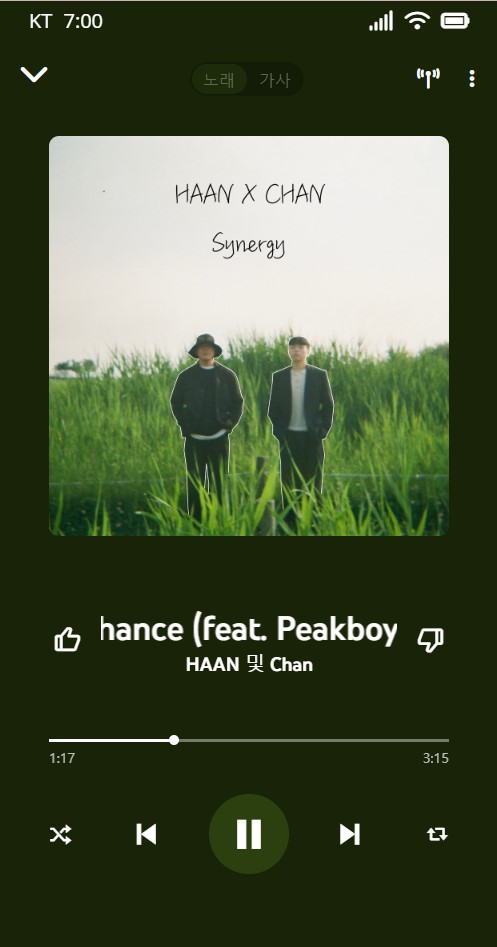
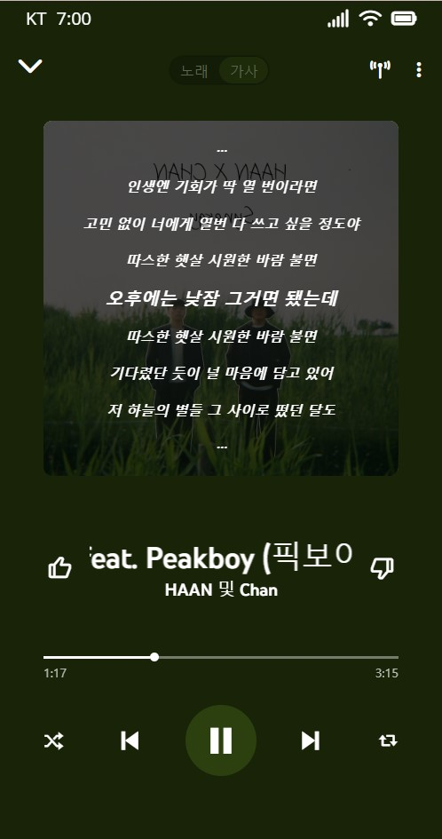

# Youtube-music 클론
-------------
CSS와 HTML을 사용한 뮤직 플레이어 사이트입니다.

### 🖥️ 프로젝트 소개
-------------
Youtube-music을 참고하여 만들었으며 모바일 사이즈에 맞춰 만들어졌습니다.
노마드코더의 '코코아톡 클론코딩 2020' 강의를 수강한 뒤 배운 스택을 기반으로 한 사이드 프로젝트입니다.

### 🕰️개발 기간
-------------
#### 학습 기간 : 2023.08.15~ 2023.08.27 (2주)
#### 개발 기간 : 2023.08.30~2023.09.02 (4일)
개인 토이 프로젝트입니다.

### ⚙️ 개발 환경
-------------
- IDE : 
- Stack :  
- SCM : 

### 📌 주요 기능
-------------
| # | FileName | Preview | Point |
|:---:|:----------:|:---------:|-------|
| 1 | index.html        |         |  사용자의 Screen Size 통일을 위한 시작화면     |
| 2 | index.html         |          | Scroll, position:fixed 를 사용한 'index' 화면.   My playlist 컨포넌트 선택시 playlist.html로 연결     |
| 3 | popular.html         |         | 애니메이션이 추가된 'popular'화면      |
| 4 | storage.html         |         |  index, popular에서 사용한 컨포넌트를 common으로 묶어 공통 사용한 'storage'화면     |
| 5 | playlist.html         |         |  모든 화면에서 'My Playlist' 클릭시 연결되는 화면.   버튼에 애니메이션 사용. 버튼 클릭시 playing.html로 연결    |
| 6 | playing.html         |          |  상단 토글 클릭에 따라 transition 및 view change 기능이 추가된 'play'화면     |

